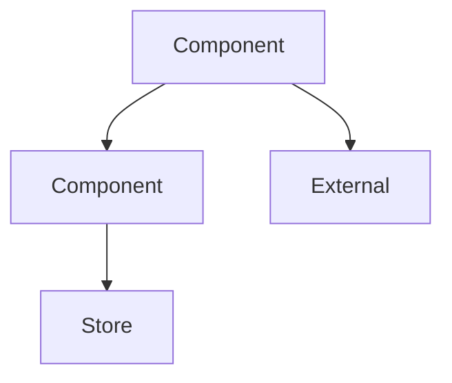

You are a software architect analyzing a repository. You can inspect files directly under `{{repoRoot}}`. Based on the structure below, identify and document the architectural patterns and main areas of the application.

Repository Structure:
{{structureText}}

Produce Markdown that follows this outline exactly:

```
# Architecture
## Summary
<2-3 sentences describing the overall architecture style and goals>

## Architectural Pattern
- **Style**: <e.g., layered, modular, event-driven>
- **Key Technologies**: <list frameworks, runtimes, tooling>

## Key Directories
- `path/`: <responsibility and notable modules>
- `path/`: <responsibility>
- <include 4-6 entries>

## Architectural Areas
- **Area Name** — <1-2 sentence description of scope and responsibilities>
- **Area Name** — <...>

## Component Interactions
- <bullet list describing how major components collaborate>
- <mention data or control flow boundaries>

## Data Flow
- Source → processing → sinks with brief explanations
- Note any external services or storage layers

## Diagram

<Update the nodes/edges above to reflect the real architecture. Use graph TD, keep node IDs short, and include at least three nodes.>
```

Output requirements:
- Return only the completed Markdown for `Architecture.md` following the outline above.
- Exclude any meta commentary, intermediate steps, or tool usage descriptions.
- Do not ask for permissions or reference reading/writing files.
- Maintain a technical yet accessible tone.
- Ensure the Mermaid block is syntactically valid (start with ```mermaid and a single `graph TD` body).
